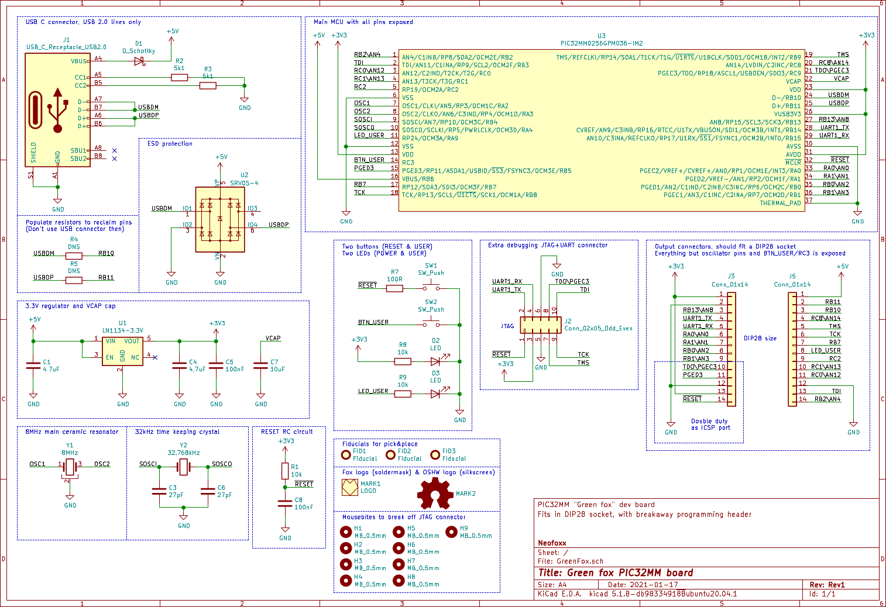
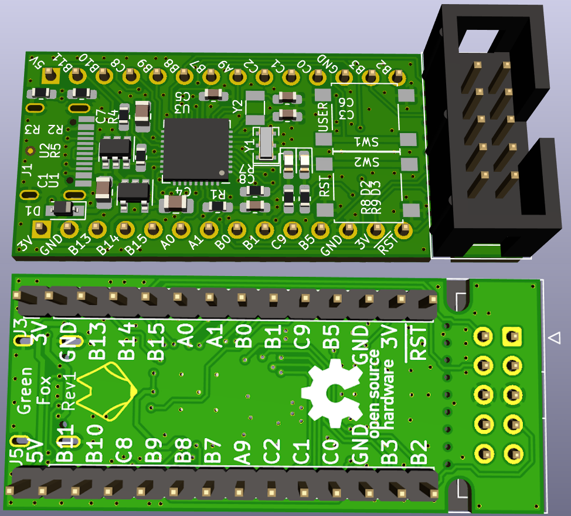
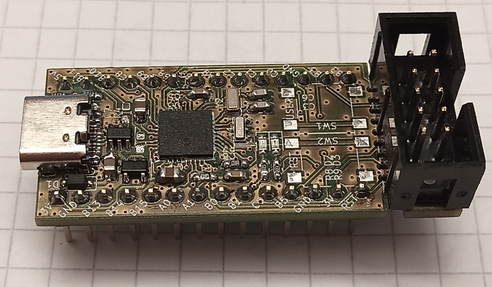

# GreenFoxBoard
This is a small PIC32MM GPM development board.

#### Schematic

#### Render

#### PCB

## Description
This is a small PIC32MM dev board, for the GPM series of parts (aka /w USB support).

The idea is to have a board, that can be quickly used with the [open-source toolchain for PIC32s](https://gitlab.com/spicastack/pic32-parts-free).

The feature list is as follows:
- PIC32MM0256GPM036-I/M2, 2.0V to 3.6V, 25MHz max., 256kB flash, 32kB RAM
- USB-C connector
- ESD protection on USB pins
- Two LEDs, one Power, one User
- Two buttons, one Reset, one User
- Components only on one side
- Fits into 28-pin DIP socket (wide)
- Breakaway section on the PCB, with a JTAG+UART connector for easy programming
- Pin markings on both top and bottom

The JTAG+UART connector is there for ease of access. You can also score the vias with a knife, and break that part off. The JTAG+UART pins are also available on other pins, not just on the breakaway.

ICSP pins are routed to the bottom left of the board, in a standard ICD/PICkit pinout, for easy connecting.

Two crystals are present - an 8MHz one and a 32.768kHz one. Pins used for these crystals are not routed to the header pins.

USB works without any crystals - USB clock tuning on-the-go built into the peripheral is confirmed working. Tested with a modified version of [m-stack](https://github.com/signal11/m-stack).

## Notes

Be careful when ordering the chips, as theee are two 36-pin namings, but one actually has 40-pins. You needs the PIC32MM0256GPM036-I/**M2** version, **not MV**

Make sure to use the latest fersion of [Progyon](https://gitlab.com/spicastack/progyon) for programming, as it includes a fix that previously disabled JTAG pins for use during runtime.

## Files
* The Gerber files are in the HW/GreenFox/Gerbers directory
* The BOM is in the HW/GreenFox/ibom directory
* The schematic is here in the root directory